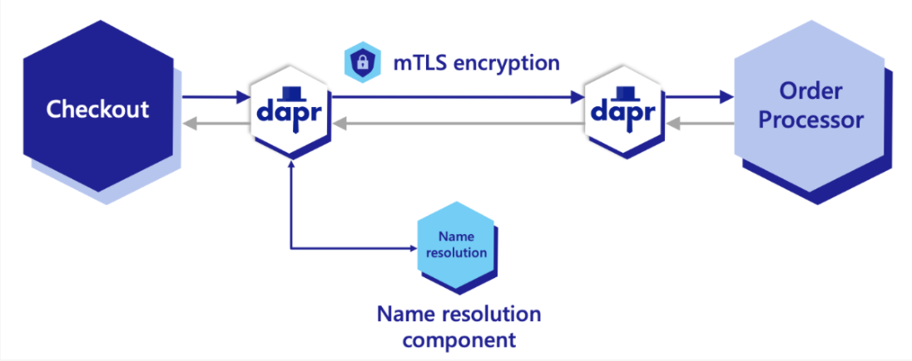
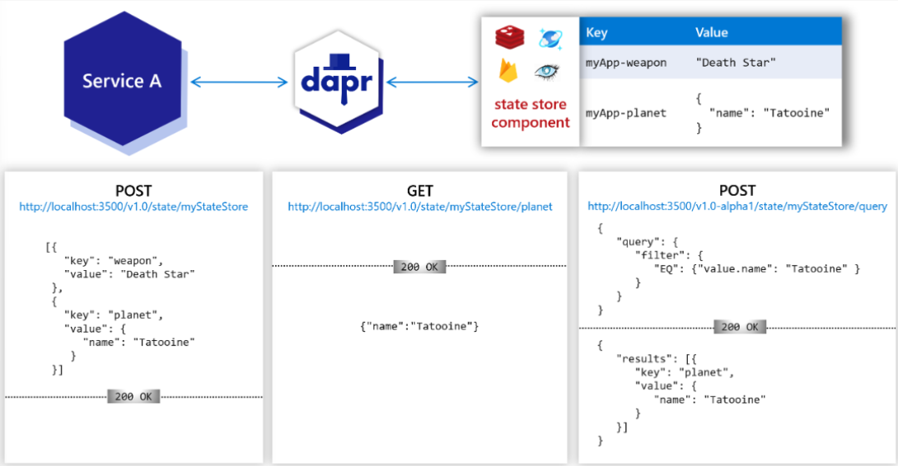
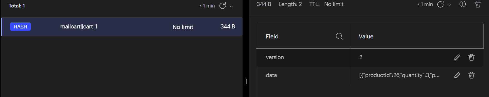
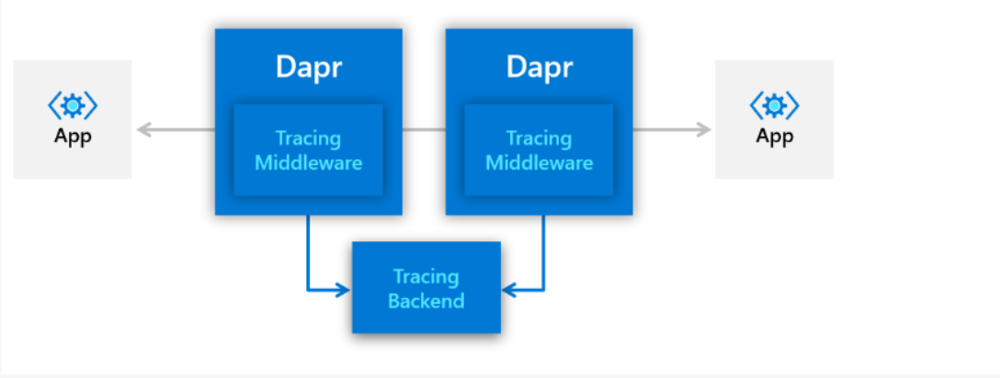
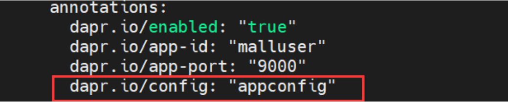
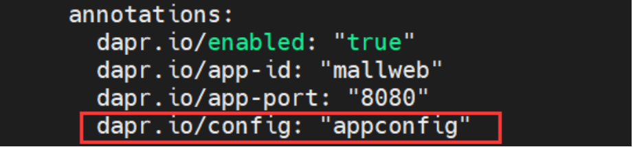
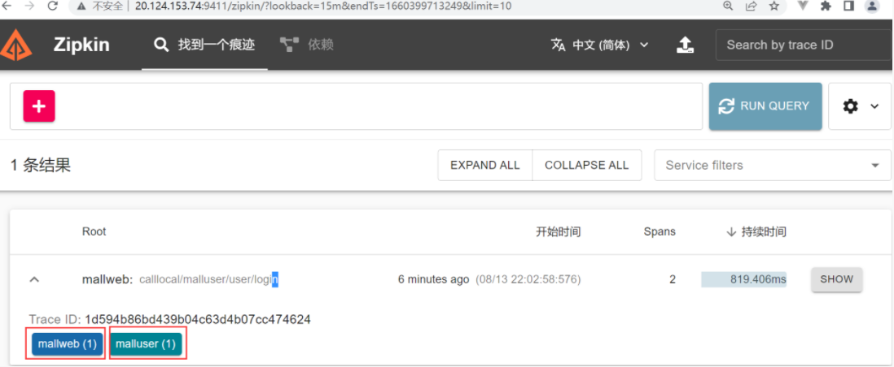
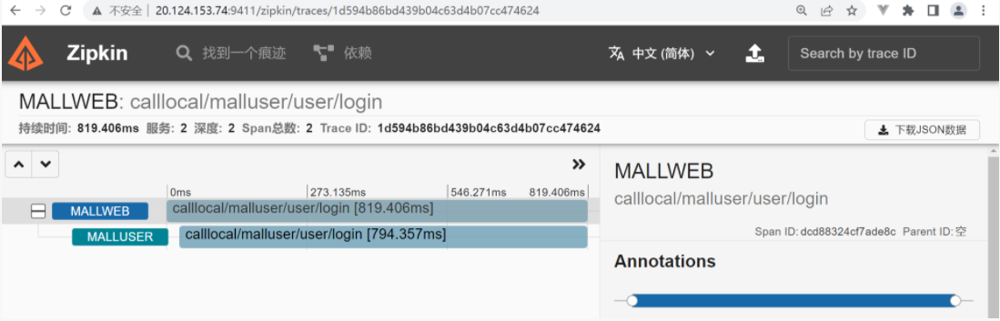
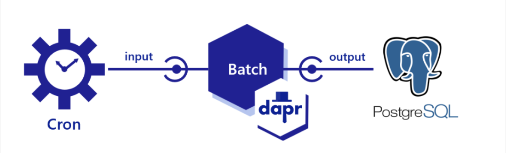
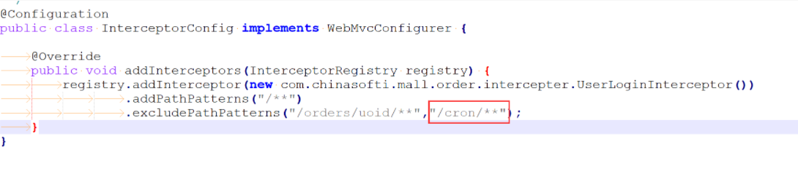

### dapr

> 我们本次试验是安装dapr到kubernetes集群上，请确保我们有kubernetes集群

安装dapr cli

```bash
wget -q https://raw.githubusercontent.com/dapr/cli/master/install/install.sh -O - | /bin/bash
```

验证是否成功

```bash
dapr

          __
     ____/ /___ _____  _____
    / __  / __ '/ __ \/ ___/
   / /_/ / /_/ / /_/ / /
   \__,_/\__,_/ .___/_/
             /_/

===============================
Distributed Application Runtime

Usage:
  dapr [command]

Available Commands:
  annotate       Add dapr annotations to a Kubernetes configuration. Supported platforms: Kubernetes
  build-info     Print build info of Dapr CLI and runtime
  completion     Generates shell completion scripts
  components     List all Dapr components. Supported platforms: Kubernetes
  configurations List all Dapr configurations. Supported platforms: Kubernetes
  dashboard      Start Dapr dashboard. Supported platforms: Kubernetes and self-hosted
  help           Help about any command
  init           Install Dapr on supported hosting platforms. Supported platforms: Kubernetes and self-hosted
  invoke         Invoke a method on a given Dapr application. Supported platforms: Self-hosted
  list           List all Dapr instances. Supported platforms: Kubernetes and self-hosted
  logs           Get Dapr sidecar logs for an application. Supported platforms: Kubernetes
  mtls           Check if mTLS is enabled. Supported platforms: Kubernetes
  publish        Publish a pub-sub event. Supported platforms: Self-hosted
  run            Run Dapr and (optionally) your application side by side. Supported platforms: Self-hosted
  status         Show the health status of Dapr services. Supported platforms: Kubernetes
  stop           Stop Dapr instances and their associated apps. Supported platforms: Self-hosted
  uninstall      Uninstall Dapr runtime. Supported platforms: Kubernetes and self-hosted
  upgrade        Upgrades or downgrades a Dapr control plane installation in a cluster. Supported platforms: Kubernetes
  version        Print Dapr runtime and Cli version.
```

通过dapr-cli安装dapr到kubernetes中

```bash
apr init --kubernetes --wait
```

输出信息如下表示成功

```bash
⌛  Making the jump to hyperspace...
  Note: To install Dapr using Helm, see here: https://docs.dapr.io/getting-started/install-dapr-kubernetes/#install-with-helm-advanced

✅  Deploying the Dapr control plane to your cluster...
✅  Success! Dapr has been installed to namespace dapr-system.
```

验证

```bash
dapr status -k
```

输出信息如下表示成功

```bash
jamesxPenn@xuepeng:~$ dapr status -k
  NAME                   NAMESPACE    HEALTHY  STATUS   REPLICAS  VERSION  AGE  CREATED
  dapr-operator          dapr-system  True     Running  1         1.8.3    16s  2022-08-11 07:41.32
  dapr-placement-server  dapr-system  True     Running  1         1.8.3    16s  2022-08-11 07:41.32
  dapr-sentry            dapr-system  True     Running  1         1.8.3    16s  2022-08-11 07:41.32
  dapr-sidecar-injector  dapr-system  True     Running  1         1.8.3    16s  2022-08-11 07:41.32
  dapr-dashboard         dapr-system  True     Running  1         0.10.0   16s  2022-08-11 07:41.32      
```

### 目录结构

```bash
├── deploy（存放部署文件）                                       
│   ├── components（存放dapr组件）  
│   │   ├── binding-cron.yaml
│   │   ├── mysql.yaml
│   │   ├── rabbitmq.yaml
│   │   └── statestore.yaml
│   ├── mall.cart.yaml （各个具体微服务的部署文件）                        
│   ├── mall.gateway.yaml
│   ├── mall.order.yaml
│   ├── mall.pay.yaml
│   ├── mall.product.yaml
│   ├── mall.shipping.yaml
│   ├── mall.user.yaml
│   └── rabbit
│       ├── rabbitmq.pvc.yaml
│       └── rabbitmq.yaml
├── mall-cart(各个微服务)
└── sql（存放sql脚本）
    ├── mall_nacos.sql
    ├── mall_order.sql
    ├── mall_pay.sql
    ├── mall_product.sql
    ├── mall_shipping.sql
    └── mall_user.sql
```

所有项目重新部署

```bash
kubectl delete -f .
kubectl apply -f .
```

确保每一个微服务pod是两个

```bash
kubectl get pods
```

```bash
mall-cart-7f4f778c85-rf8sg       2/2     Running     0          68s
mall-gateway-7d486f679f-47kgk    2/2     Running     0          67s
mall-order-799f9bc66d-7c8mc      2/2     Running     0          66s
mall-pay-868d788664-v6w5q        2/2     Running     0          65s
mall-product-55b4dc7bd5-lg8x7    2/2     Running     0          64s
mall-shipping-55df99448c-9cs4s   2/2     Running     0          63s
mall-user-55c5777649-g57rf       2/2     Running     0          62s
```

同理，前端类似

```git
# git tag和commit挂钩，和分支没关系
git tag -a v0.1 -m 'add annotaion'
git push origin v0.1
```

### 服务远程调用

#### 概念



> 通过服务调用，应用程序可以使用 [gRPC](https://grpc.io/) 或 [HTTP](https://www.w3.org/Protocols/) 这样的标准协议来发现并可靠地与其他应用程序通信。
> 
> Dapr 通过提供服务调用 API 来应对这些问题，这种调用 API 作为反向代理与内置的服务发现相结合， 同时利用内置分布式跟踪、计量、错误处理、加密等功能。


#### 前端调用后端

> 我的代码已经打了tag，如果想要快速试验，git checkout v0.2

找到前端的server.js文件

```javascript
const express = require('express');
const path = require('path');
const bodyParser = require('body-parser');
const axios = require('axios');

const app = express();

app.use(express.json());

const port = 8080;

const gateWayUrl = process.env.GATEWAY_URL || "http://mall-gateway:9001";
/**
 *  定义dapr端口和访问地址
 *   
 */
const daprPort = process.env.DAPR_HTTP_PORT || 3500;
const daprUrl = `http://localhost:${daprPort}/v1.0/invoke`;


/**
 *  mall-web pod里面包含两个容器，共享网络栈
 *  1 mall-web容器
 *  2 dapr sidercar容器 
 *  
 *   服务调用的逻辑
 *   1 mall-web容器接收到"/api/user/login"的请求，被转发到dapr sidecar容器，转发规则如下：
 *     {daprUrl}/{daprAppid}/method/{endpointurl}
 *   2 dapr sidecar容器根据daprAppId去dapr域名服务器查找对应的pod ip
 *   3 比如此处malluser 就是被找到的pod
 *   4 malluser pod中的dapr sidecar接收到请求
 *   5 根据endpointurl去寻找malluser app中的方法进行远程调用
 *   6 经过层层返回，最终返回到调用方
 *
 */
app.post('/api/user/login', async (req, res) => {

  const appResponse = await axios.post(`${daprUrl}/malluser/method/user/login`, 
    req.body,
    {
      headers:req.headers
    }
  )

  return res.send(appResponse.data); 

});


app.post('/api/*', async (req, res) => {

  const appResponse = await axios.post(`${gateWayUrl}${req.originalUrl}`, 
    req.body,
    {
      headers:req.headers
    }
  )

  return res.send(appResponse.data); 

});

app.get('/api/*', async (req, res) => {

  const appResponse = await axios.get(
    `${gateWayUrl}${req.originalUrl}`,
    {
      params:req.query,
      headers:req.headers
    }
  )
  return res.send(appResponse.data); 

});

app.put('/api/*', async (req, res) => {

  const appResponse = await axios.put(
    `${gateWayUrl}${req.originalUrl}`,
    req.body,
    {
      params:req.query,
      headers:req.headers
    }
  )
  return res.send(appResponse.data); 

});

app.delete('/api/*', async (req, res) => {

  const appResponse = await axios.delete(
    `${gateWayUrl}${req.originalUrl}`,
    {
      params:req.query,
      headers:req.headers
    }
  )
  return res.send(appResponse.data); 

});

// Serve static files
app.use(express.static(path.join(__dirname, 'client/dist')));

// For default home request route to React client
app.get('/', async function (_req, res) {
  return await res.sendFile(path.join(__dirname, 'client/dist', 'index.html'));
});

app.listen(process.env.PORT || port, () => console.log(`Listening on port ${port}!`));
```

修改完毕后，重新部署

```bash
cd deploy
kubectl delete -f mall.web.yaml
```

自己重新打镜像或者用我已经打好的镜像，使用我打好的镜像

```bash
vim mall.web.yaml
#镜像版本修改到v2
- image: jamesxpenn/mall-web:v2
```

重新部署

```bash
kubectl apply -f mall.web.yaml
```

#### 后端调用后端

> 当给购物车添加商品时，前端传递过来商品id，购物车服务通过商品id远程调用商品服务。

找到mall-cart项目，在service中找到CartServiceImpl类，修改如下

```java
//注销掉之前productFeign调用远程的代码
//        Response<ProductDetail> productvo = productFeign.getProduct(form.getProductId());
//        ProductDetail product=productvo.getData()
//加入以下dapr远程调用的代码  
        /**
         * dapr Service Invocation start
         *
         * 1 mall-cart的容器通过localhost:3500找到同一个pod的边车及dapr sidecar
         * 2 dapr sidecar通过 header标注的"dapr-app-id"为"mallproduct"，在dpar域名服务中查找mallproduct
         * 3 mallproduct中的dapr sidecar 在调用mall-product这个容器的endpoint:"/products/productID"
         */
        String dapr_url = "http://localhost:"+DAPR_HTTP_PORT+"/products/"+form.getProductId();

        HttpRequest request = HttpRequest.newBuilder().GET()
                .uri(URI.create(dapr_url))
                .header("dapr-app-id", "mallproduct")
                .build();
        HttpResponse<String> httpResponse;
        try {
            httpResponse = httpClient.send(request, HttpResponse.BodyHandlers.ofString());
        } catch (IOException e) {
            throw new RuntimeException(e);
        } catch (InterruptedException e) {
            throw new RuntimeException(e);
        }
        ObjectMapper objectMapper = new ObjectMapper();
        Response<ProductDetail> response = null;
        try {
            response = objectMapper.readValue(httpResponse.body(), Response.class);
        } catch (JsonProcessingException e) {
            throw new RuntimeException(e);
        }
        ProductDetail product = objectMapper.convertValue(response.getData(), new TypeReference<ProductDetail>(){});
        /**
         * dapr Service Invocation end
         */
```

以上代码引用了一些dapr_url,DAPR_HTTP_PORT等。

```java
    /**
     * dapr config start
     */
    private static final String DAPR_HTTP_PORT = System.getenv().getOrDefault("DAPR_HTTP_PORT", "3500");
    private static String DAPR_HOST = System.getenv().getOrDefault("DAPR_HOST", "http://localhost");
    private static final HttpClient httpClient = HttpClient.newBuilder()
            .version(HttpClient.Version.HTTP_2)
            .connectTimeout(Duration.ofSeconds(10))
            .build();
    /**
     * dapr config end
     */
```

git tag -a v0.2 -m '服务远程调用'

### 状态管理

#### 概念



> 使用状态管理可以存储一些key，value的值。它的优势如下：
> 
> 1 可插拔的状态存储
> 
> 2 可配置状态的存储行为。比如并发要求（eTag乐观锁），一致性要求等

#### 目标

> 在往购物车添加商品的时候
> 
> 1 从redis中取出现有购物车所有的商品（从redis中读数据）
> 
> 2 将新购买的商品加入到现有购物车中（往redis中写数据）

##### dapr中创建redis的component

> dpar中有各种各样的component，简单来说，dapr中的component作用是连接外部组件，比如redis，rabitmq，kafka等等，以后我们程序中就不用直接访问这些组件，而是调用dapr提供给我们的api，实现了解耦，从而达到可以再运行时动态切换组件。

statestore.yaml

```yaml
apiVersion: dapr.io/v1alpha1
kind: Component
metadata:
  name: statestore
spec:
  type: state.redis
  version: v1
  metadata:
  - name: redisHost
    value: redis-headless:6379
  - name: redisPassword
    secretKeyRef:
      name: secret-redis
      key: password
  - name: actorStateStore
    value: "true"
```

git tag -a v0.3 -m '状态存储'

部署

```bash
cd /mall/deploy/components
kubectl apply -f statestore.yaml
```

##### 修改mall-cart微服务代码

找到mall-cart项目，在service中找到CartServiceImpl类，修改如下

```java
        /**
         * 注释掉从redis中取出现有购物车所有的商品
         */
//        String value = opsForHash.get(redisKey, "data");
//        if (StringUtils.isEmpty(value)) {
//            //没有该商品, 新增
//            cart = new Cart(product.getId(), quantity, form.getSelected());
//            cartList.add(cart);
//        }else {
//
//            cartList = gson.fromJson((String)value, new TypeToken<ArrayList<Cart>>(){}.getType());
//
//            for(Cart item: cartList){
//                //已经有了，数量+1
//                if(item.getProductId().equals(product.getId())){
//                    hasProduct=true;
//                    item.setQuantity(item.getQuantity() + quantity);
//                }
//            }
//            if(!hasProduct){
//                cart = new Cart(product.getId(), quantity, form.getSelected());
//                cartList.add(cart);
//            }
//        }


        /**
         * 从redis中取出现有购物车所有的商品（从redis中读数据）
         *
         * mallcart容器调用dapr的sidecar访问存储，访问路径为：
         * {DAPR_HOST}:{DAPR_HTTP_PORT}/v1.0/state/{statestore}/{rediskey}
         * 其中statestore是 dapr定义redis component的名字
         *
         */

        URI baseUrl = null;
        String DAPR_STATE_STORE = "statestore";
        //String redisDapyKey  = String.format(CART_REDIS_KEY_TEMPLATE, uid);
        try {
            baseUrl = new URI(DAPR_HOST+":"+DAPR_HTTP_PORT);
        } catch (URISyntaxException e) {
            throw new RuntimeException(e);
        }
        URI getStateURL = null;
        try {
            getStateURL = new URI(baseUrl + "/v1.0/state/"+DAPR_STATE_STORE+"/"+redisKey);
        } catch (URISyntaxException e) {
            throw new RuntimeException(e);
        }

        request = HttpRequest.newBuilder()
                .GET()
                .uri(getStateURL)
                .build();
        HttpResponse<String> stateResponse=null;
        try {
            stateResponse = httpClient.send(request, HttpResponse.BodyHandlers.ofString());
        } catch (IOException e) {
            throw new RuntimeException(e);
        } catch (InterruptedException e) {
            throw new RuntimeException(e);
        }

        if (StringUtils.isEmpty(stateResponse.body())) {
            //没有该商品, 新增
            cart = new Cart(product.getId(), quantity, form.getSelected());
            cartList.add(cart);
        }else {

            cartList = gson.fromJson((String)stateResponse.body(), new TypeToken<ArrayList<Cart>>(){}.getType());

            for(Cart item: cartList){
                //已经有了，数量+1
                if(item.getProductId().equals(product.getId())){
                    hasProduct=true;
                    item.setQuantity(item.getQuantity() + quantity);
                }
            }
            if(!hasProduct){
                cart = new Cart(product.getId(), quantity, form.getSelected());
                cartList.add(cart);
            }
        }

        /**
         * 注释掉原始的将新购买的商品加入到现有购物车中（加入到redis）
         */
//        opsForHash.put(redisKey,
//                "data",
//                gson.toJson(cartList));


        /**
         * 将新购买的商品加入到现有购物车中（往redis中写数据）
         *
         */
        URI stateStoreUrl=null;
        try {
            stateStoreUrl = new URI(baseUrl + "/v1.0/state/"+DAPR_STATE_STORE);
        } catch (URISyntaxException e) {
            throw new RuntimeException(e);
        }

        State state = new State(redisKey, cartList);
        State[] payload = new State[] {state};
        try {
            request = HttpRequest.newBuilder()
                    .POST(HttpRequest.BodyPublishers.ofString(objectMapper.writeValueAsString(payload)))
                    .uri(stateStoreUrl)
                    .build();
        } catch (JsonProcessingException e) {
            throw new RuntimeException(e);
        }

        try {
            httpClient.send(request, HttpResponse.BodyHandlers.ofString());
        } catch (IOException e) {
            throw new RuntimeException(e);
        } catch (InterruptedException e) {
            throw new RuntimeException(e);
        }
```



> 看上图我们发现，dapr在redis中存储规则如下：
> 
> 存储的键为：{appid}+||+{key}。
> 
> 多了一个version字段，这个字段是实现乐观锁。
> 
> 我们用dapr修改了状态存储想要立马运行，会报错。因为这个类其他地方操作redis的时候还是用传统的方式，主键是key，删除data的时候也没有考虑到删除version字段。所有需要将他们也一并修改。修改方式如下：

- [x] rediskey的修改

```java
//String redisKey  = String.format(CART_REDIS_KEY_TEMPLATE, uid);
String redisKey  = "mallcart||"+String.format(CART_REDIS_KEY_TEMPLATE, uid);
```

- [x] 删除的时候需要删除version

```java
//        if(cartList.size()==0){
//            opsForHash.delete(redisKey, "data");
//        }else{
//            opsForHash.put(redisKey, "data", gson.toJson(cartList));
//        }
 //这里只是为了兼容dapr，因为dapr的存储包含一个version字段。用dapr的delete statement方法删除就好。
        if (!StringUtils.isEmpty(versionStr)) {
                opsForHash.delete(redisKey,"version");
            }
            opsForHash.delete(redisKey, "data");
        }else{
            opsForHash.put(redisKey, "data", gson.toJson(cartList));
        }    }
```

### 可观测性

#### 概念



> Dapr 使用 Zipkin 协议进行分布式跟踪和指标收集。 由于 Zipkin 协议无处不在，许多后端被开箱即用，例如 [Stackdriver](https://cloud.google.com/stackdriver)、 [Zipkin](https://zipkin.io/)、 [New Relic](https://newrelic.com/) 等。 与 OpenTelemetry 收藏器组合，Dapr 可以导出跟踪到许多其他后端，包括但不局限于 [Azure Monitor](https://azure.microsoft.com/en-us/services/monitor/) [Datadog](https://www.datadoghq.com/), [Instanca](https://www.instana.com/), [Jaeger](https://www.jaegertracing.io/), and [SignalFX](https://www.signalfx.com/)

#### 目标

> 在用户登录的时候，可以看到监控用户的调用情况

#### 部署zipkin

/mall/deploy/components/zipkin.yml

```yml
apiVersion: apps/v1
kind: Deployment
metadata:
  name: zipkin
  labels:
    app: zipkin
spec:
  replicas: 1
  selector:
    matchLabels:
      app: zipkin
  template:
    metadata:
      labels:
        app: zipkin
    spec:
      containers:
      - name: zipkin
        image: openzipkin/zipkin
        ports:
        - containerPort: 9411

---

kind: Service
apiVersion: v1
metadata:
  name: zipkin
  labels:
    app: zipkin
spec:
  selector:
    app: zipkin
  ports:
  - protocol: TCP
    port: 9411
    targetPort: 9411
  type: LoadBalancer
```

添加配置

```yaml
apiVersion: dapr.io/v1alpha1
kind: Configuration
metadata:
  name: appconfig
spec:
  tracing:
    samplingRate: "1"
    zipkin:
      endpointAddress: "http://zipkin.default.svc.cluster.local:9411/api/v2/spans"
```

程序中添加注解，**注意，名称和Configuration中的name保持一致**

因为前端服务登录调用后端mall-user，所以在mall-user中的部署文件加入以下

/home/jamesxPenn/mall/deploy/mall.user.yaml



/home/jamesxPenn/mall-web/deploy/mall.web.yaml



都重新部署这两个

找到web的访问地址，重新登录以下。

```bash
kubectl get svc | grep web
mall-web      LoadBalancer   10.0.225.237   20.241.208.10    80:30046/TCP 
```

找到zipkin的访问地址

```bash
kubectl get svc | grep zipken
zipkin       LoadBalancer   10.0.97.32     20.124.153.74    9411:30505/TCP
```

访问zipkin后，看到如下页面：



点击“show”按钮，可以看到服务调用的时长



web  tag v0.3

mall tag v0.4 

### 绑定

#### 概念



> 使用绑定，您可以使用来自外部系统的事件或与外部系统的接口来触发应用程序。
> 
> 输入绑定：输入绑定用于在发生来自外部资源的事件时触发应用程序。 可选的有效负载和元数据可以与请求一起发送。
> 
> 输出绑定：输出绑定允许用户调用外部资源。 可选的有效负载和元数据可与调用请求一起发送。

#### 优势

- 除去连接到消息传递系统 ( 如队列和消息总线 ) 并进行轮询的复杂性
- 聚焦于业务逻辑，而不是如何与系统交互的实现细节
- 使代码不受 SDK 或库的跟踪
- 处理重试和故障恢复
- 在运行时在绑定之间切换
- 构建具有特定于环境的绑定的可移植应用程序，不需要进行代码更改

#### 目标

> 订单服务有一个定时关单的功能，如果客户下了订单，但是10分钟内没有支付，这边就需要将客户的订单关闭。是一个定时任务去轮询判断。这里将这个定时任务作为输入绑定。我们需要将超时没有支付的订单关闭，修改订单状态，这用到输出绑定。

git tag -a v0.5 -m 'dapr 绑定'
git push origin v0.1

##### 定义组件

/home/jamesxPenn/mall/deploy/components/binding-cron.yaml

```yaml
apiVersion: dapr.io/v1alpha1
kind: Component
metadata:
  name: cron
spec:
  type: bindings.cron
  version: v1
  metadata:
  - name: schedule
    value: "@every 60s" # valid cron schedule
```

/home/jamesxPenn/mall/deploy/components/mysql.yaml

```yaml
apiVersion: dapr.io/v1alpha1
kind: Component
metadata:
  name: sqldb
spec:
  type: bindings.mysql
  version: v1
  metadata:
    - name: url # Required, define DB connection in DSN format
      value: "root:q3foT5xcGe@tcp(mysql-headless:3306)/mall_order?allowNativePasswords=true"
```

##### 修改代码

/home/jamesxPenn/mall/mall-order/src/main/java/com/chinasofti/mall/order/task/OrderTask

```java
//注释掉component
@Slf4j
//@Component
public class OrderTask {
.....
}
```

/mall/mall-order/src/main/java/com/chinasofti/mall/order/controller/OrderController

添加如下代码：

```java
import java.io.IOException;
import java.net.URI;
import java.net.http.HttpClient;
import java.net.http.HttpRequest;
import java.net.http.HttpResponse;
import java.time.Duration;
import java.util.List;
import com.chinasofti.mall.order.pojo.Order;
import com.chinasofti.mall.order.dao.OrderMapper;
import com.alibaba.fastjson.JSONObject;    

    @Autowired
    OrderMapper orderMapper;
    private static final String sqlBindingName = "sqldb";

    private static final HttpClient httpClient = HttpClient.newBuilder()
            .version(HttpClient.Version.HTTP_2)
            .connectTimeout(Duration.ofSeconds(10))
            .build();
    private static String DAPR_HOST = System.getenv().getOrDefault("DAPR_HOST", "http://localhost");
    private static String DAPR_HTTP_PORT = System.getenv().getOrDefault("DAPR_HTTP_PORT", "3605");

    /**
     * dapr bindings
     *
     * 输入绑定：绑定定时任务，名称就是类型为“bindings.cron”的dapr component
     * 输出绑定：输出到mysql数据库中，把超时支付的订单状态修改为“交易关闭”
     *
     * @throws Exception
     */
    @PostMapping(path = cronBindingPath, consumes = MediaType.ALL_VALUE)
    public void closeOrder() throws Exception {
        //orderMapper.selectByOrderNo()

        String daprUri = DAPR_HOST +":"+ DAPR_HTTP_PORT + "/v1.0/bindings/"+sqlBindingName;


        List<Order> orders = orderMapper.selectNoPayOrderTimeOut(OrderStatus.NOTPAY.getCode());


        /**
         * dapr bindings output
         */
        orders.stream().forEach(order->{
            order.setStatus(OrderStatus.CLOSED.getCode());
            orderMapper.updateByPrimaryKeySelective(order);

            String sqlText = String.format(
            "update mall_order set status = %s where id = %s;",
                    OrderStatus.CLOSED.getCode(),order.getId());

            System.out.println("sqltest"+sqlText);
            JSONObject command = new JSONObject();
            command.put("sql", sqlText);

            JSONObject payload = new JSONObject();
            payload.put("metadata", command);
            payload.put("operation", "exec");

            HttpRequest request = HttpRequest.newBuilder()
                    .POST(HttpRequest.BodyPublishers.ofString(payload.toString()))
                    .uri(URI.create(daprUri))
                    .header("Content-Type", "application/json")
                    .build();

            try {
                HttpResponse<String> response = httpClient.send(request, HttpResponse.BodyHandlers.ofString());
            } catch (IOException e) {
                throw new RuntimeException(e);
            } catch (InterruptedException e) {
                throw new RuntimeException(e);
            }

        });
    }
```

拦截器中加入以下代码，让输入绑定不会被拦截掉：

/home/jamesxPenn/mall/mall-order/src/main/java/com/chinasofti/mall/order/config/InterceptorConfig



重新打包发布测试。进行一次购买，然后不要支付，等五分钟后再我的订单里面看订单状态是否需改为“交易关闭”。

访问zipkin后

### pubsub

#### 概念

#### 目标

> 支付系统进行支付后，会发送一个消息到订单系统，订单系统修改订单状态为已支付

git tag -a v0.6 -m 'dapr subpub'
git push origin v0.1

#### 改造

##### 添加组件

dapr和rabbitmq组件通讯，我们需要做一个rabbitmq的component。

/home/jamesxPenn/mall/deploy/rabbitmq.yaml

```yaml
apiVersion: dapr.io/v1alpha1
kind: Component
metadata:
  name: orderpubsub
spec:
  type: pubsub.rabbitmq
  version: v1
  metadata:
  - name: host
    value: "amqp://rmq-headless:5672"
  - name: durable
    value: "true"
  - name: deletedWhenUnused
    value: "false"
  - name: autoAck
    value: "false"
  - name: reconnectWait
    value: "0"
  - name: concurrency
    value: parallel
```

##### 修改代码

将com.chinasofti.mall.order.listener.PayMsgListener中的注解注释掉，让他丧失接收rabbitmq功能

```java
//@Component
//@Slf4j
public class PayMsgListener {

    @Autowired
    OrderMapper orderMapper;


    //收到微信的通知，修改订单状态
    @RabbitListener(queues = "order.queue")
    public void process(String ordreNo){
       // log.info("接收到消息{}",ordreNo);
        Order order = orderMapper.selectByOrderNo(Long.valueOf(ordreNo));
        order.setStatus(OrderStatus.SUCCESS.getCode());
        orderMapper.updateByPrimaryKeySelective(order);
    }
}
```

再com.chinasofti.mall.order.controller.OrderController中添加注册和侦听代码

```java
        /**
     *  dapr 注册Subscribe
     *
     *  注册地址/dapr/subscribe这是固定的
     *  pubSubName 这个要和subpub的component名称保持一致
     *  topic: 定义主题
     *  route：定义路由，可以通过这个路由访问
     */
    @GetMapping(path = "/dapr/subscribe", produces = MediaType.APPLICATION_JSON_VALUE)
    public DaprSubscription[] getSubscription() {
        DaprSubscription daprSubscription = DaprSubscription.builder()
                .pubSubName("orderpubsub")
                .topic("orders")
                .route("daprOrders")
                .build();
        DaprSubscription[] arr = new DaprSubscription[]{daprSubscription};
        return arr;
    }
```

```java
    /**
     *  dapr 接收消息，通过上面route定义的
     *
     */
    @PostMapping(path = "/daprOrders", consumes = MediaType.ALL_VALUE)
    public ResponseEntity<?> processOrders(@RequestBody SubscriptionData<Order> body) {

        Order order = orderMapper.selectByOrderNo(Long.valueOf(body.getData().getOrderNo()));
        order.setStatus(OrderStatus.SUCCESS.getCode());
        orderMapper.updateByPrimaryKeySelective(order);
        return ResponseEntity.ok().build();
    }
```

拦截器中放开对/daprOrders的拦截

com.chinasofti.mall.order.config.InterceptorConfig

```java
@Configuration
public class InterceptorConfig implements WebMvcConfigurer {

    @Override
    public void addInterceptors(InterceptorRegistry registry) {
        registry.addInterceptor(new com.chinasofti.mall.order.intercepter.UserLoginInterceptor())
                .addPathPatterns("/**")
                .excludePathPatterns("/orders/uoid/**","/cron/**","/daprOrders/**");
    }
}
```

添加一个model包，里面加入两个类

com.chinasofti.mall.order.model.DaprSubscription

```java
package com.chinasofti.mall.order.model;

import lombok.Builder;
import lombok.Getter;

@Builder
@Getter
public class DaprSubscription {
    private String pubSubName;
    private String topic;
    private String route;
}
```

com.chinasofti.mall.order.model.SubscriptionData

```java
package com.chinasofti.mall.order.model;

import lombok.Getter;
import lombok.Setter;

/**
 * Helps in unpacking a cloud event which Checkout application generates.
 *
 * @param <T> Type of data being passed to subscriber end point(orderProcessor app)
 */
@Getter
@Setter
public class SubscriptionData<T> {
    private T data;
}
```

修改发送方代码，com.chinasofti.pay.service.impl.PaymentInfoServiceImpl

将之前的传统的mq发送修改成dapr的发送方式

```java
package com.chinasofti.pay.service.impl;

import com.alibaba.fastjson.JSONObject;
import com.baomidou.mybatisplus.extension.service.impl.ServiceImpl;
import com.chinasofti.pay.entity.PaymentInfo;
import com.chinasofti.pay.enums.PayPlatformEnum;
import com.chinasofti.pay.mapper.PaymentInfoMapper;
import com.chinasofti.pay.service.PaymentInfoService;
import lombok.extern.slf4j.Slf4j;
import org.springframework.amqp.core.AmqpTemplate;
import org.springframework.beans.factory.annotation.Autowired;
import org.springframework.stereotype.Service;

import java.io.IOException;
import java.net.URI;
import java.net.http.HttpClient;
import java.net.http.HttpRequest;
import java.net.http.HttpResponse;
import java.time.Duration;
import java.util.UUID;

@Service
@Slf4j
public class PaymentInfoServiceImpl extends ServiceImpl<PaymentInfoMapper, PaymentInfo> implements PaymentInfoService {


    private static final HttpClient httpClient = HttpClient.newBuilder()
            .version(HttpClient.Version.HTTP_2)
            .connectTimeout(Duration.ofSeconds(10))
            .build();

    private static final String PUBSUB_NAME = "orderpubsub";
    private static final String TOPIC = "orders";
    private static String DAPR_HOST = System.getenv().getOrDefault("DAPR_HOST", "http://localhost");
    private static String DAPR_HTTP_PORT = System.getenv().getOrDefault("DAPR_HTTP_PORT", "3506");


    @Autowired
    PaymentInfoMapper paymentInfoMapper;

    @Autowired
    private AmqpTemplate amqpTemplate;

    /**
     * dapr pub
     * @param orderNo
     * @param amount
     */
    @Override
    public void create(String orderNo, Integer amount) {
        PaymentInfo paymentInfo = new PaymentInfo();
        paymentInfo.setOrderNo(orderNo);
        paymentInfo.setPaymentType(PayPlatformEnum.WX.getName());
        paymentInfo.setPayerTotal(amount);
        paymentInfo.setTransactionId(UUID.randomUUID().toString());
        paymentInfo.setTradeType("NATIVE");
        paymentInfo.setTradeState("SUCCESS");

        paymentInfoMapper.insert(paymentInfo);

        //发送消息，通知订单服务修改订单状态
        //amqpTemplate.convertAndSend("order.exchange","order.pay", orderNo);


        /**
         * dapr publish
         *
         * 发送的地址为 DAPR_HOST:DAPR_HTTP_PORT+"/v1.0/publish/"+PUBSUB_NAME+"/"+TOPIC
         *
         */
        String uri = DAPR_HOST +":"+ DAPR_HTTP_PORT + "/v1.0/publish/"+PUBSUB_NAME+"/"+TOPIC;

        JSONObject obj = new JSONObject();
        obj.put("orderNo", orderNo);

        HttpRequest request = HttpRequest.newBuilder()
                .POST(HttpRequest.BodyPublishers.ofString(obj.toString()))
                .uri(URI.create(uri))
                .header("Content-Type", "application/json")
                .build();
        try {
            HttpResponse<String> response = httpClient.send(request, HttpResponse.BodyHandlers.ofString());
        } catch (IOException e) {
            throw new RuntimeException(e);
        } catch (InterruptedException e) {
            throw new RuntimeException(e);
        }

        log.info("Published data: {}", orderNo);

    }
}
```

发布测试运行 
