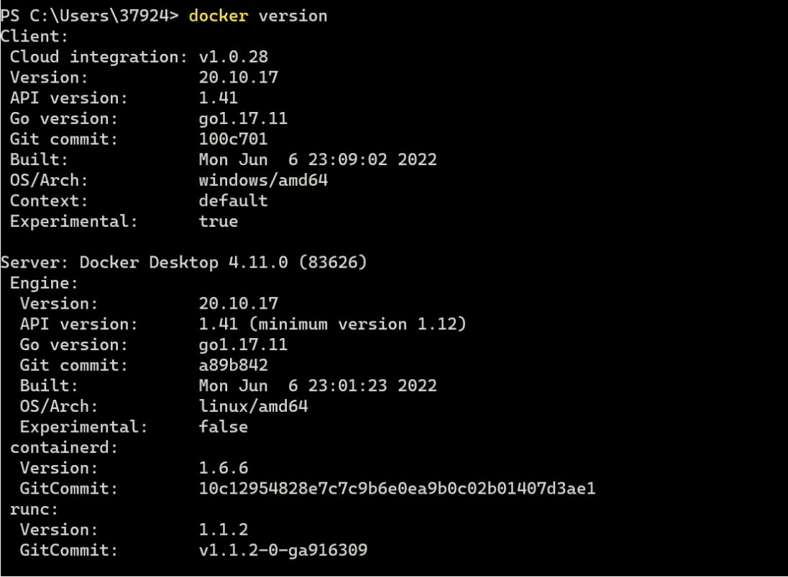

### 准备

> 在windows上准备环境，我们需要依赖第三方软件比如：redis，rabbitmq等。最简单的方式是使用Docker Desktop。为什么这么说，比如我们如果用安装包安装rabbitmq，还得先安装Eralng环境，再安装rabbitmq，显得特别的麻烦。

### 环境搭建

#### docker Desktop

##### 下载

Docker Desktop安装地址如下：

https://desktop.docker.com/win/main/amd64/Docker%20Desktop%20Installer.exe?utm_source=docker&utm_medium=webreferral&utm_campaign=dd-smartbutton&utm_location=header

一路next安装成功。

##### 启动

安装完成后启动它


##### 测试

打开一个bash窗口，输入docker version出现以下提示表示成功



#### nacos

```bash
docker run -d --name nacos -p 8848:8848 -e PREFER_HOST_MODE=hostname -e MODE=standalone nacos/nacos-server
```

docker启动成功后，输入此地址查看

UI地址:http://:8848/nacos 账号:nacos 密码:nacos


#### mysql

```bash
docker run -p 3308:3306 --name mysql \
-v /mydata/mysql/log:/var/log/mysql \
-v /mydata/mysql/data:/var/lib/mysql \
-v /mydata/mysql/conf:/etc/mysql \
-e MYSQL_ROOT_PASSWORD=root \
-d mysql:5.7 
```

用你喜欢的任意客户端去连接，用户名 root 密码 root 访问地址 localhost 访问端口 3306

- 用户名：root

- 密码：root

- 访问地址：localhost

- 访问端口：3306

#### redis

```bash
docker run -p 6379:6379 --name redis -v /mydata/redis/data:/data -d redis:3.2 redis-server --appendonly yes
```

- 访问地址：localhost

- 访问端口：3306

用你喜欢的任意客户端去连接。

#### rabbitmq

```bash
docker run -d --name rabbitmq --publish 5671:5671 \
--publish 5672:5672 --publish 4369:4369 --publish 25672:25672 --publish 15671:15671 --publish 15672:15672 \
rabbitmq:management

```

- 4369 -- erlang发现口

- 5672 --client端通信口

- 15672 -- 管理界面ui端口

- 25672 -- server间内部通信口

##### 验证

通过如下地址访问：

http://localhost:15672/

- 用户名：guest

- 密码：guest


### 初始化

#### 下载代码

```bash
git clone https://github.com/jamesxpenn/eShopOnDapr.git
```

进入到eShopOnDapr目录中，代码结构如下：


#### 导入数据库

把sql文件夹导入到数据中，**注意：每一个sql文件夹都对应一个单独的数据库。


#### 导入工程

将代码导入到idea中。

打开idea，选择open，再选择代码地址，进行导入。


#### 运行代码

进入到每个微服务模块，对启动类右键点击运行。**注意：mall-common是公用依赖，不用运行**


项目7个微服务依次，运行，出现如下结果表示成功


至此，后端微服务在windows上成功部署完毕。


