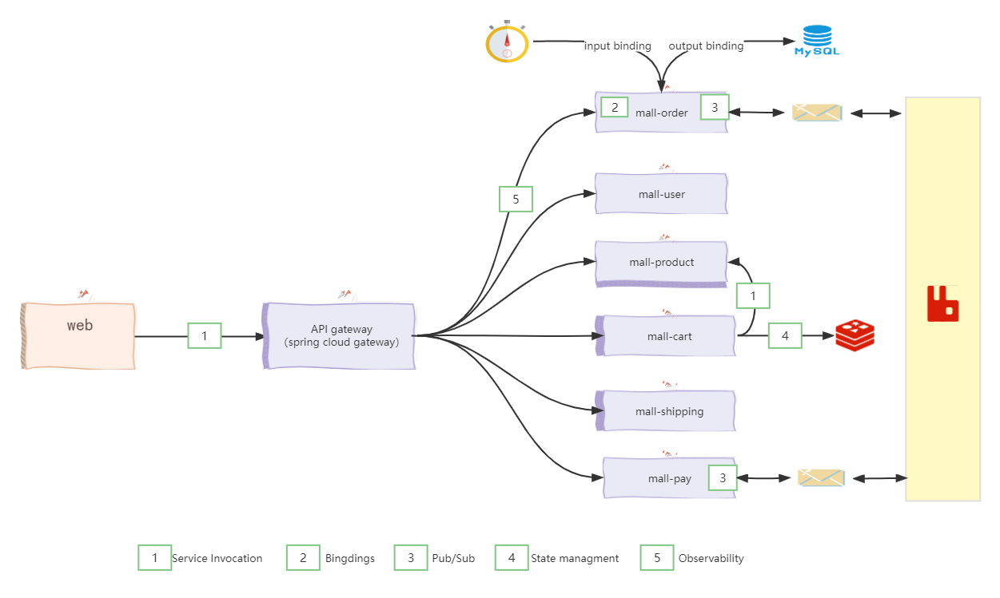

# eShop on Dapr

     mall是一个java版本的分布式应用程序**在线商城**。它的后端是由spring cloud开发，前端由vue开发。我们会一步一步带着大家将此项目改造成dapr项目。之所以考虑通过spring cloud作为切入点去介绍dapr，是因为spring cloud是目前国内进行微服务开发使用最多的框架。

    Dapr允许使用任何语言或框架的开发人员能够轻松编写微服务。它解决了分布式应用程序带来的许多挑战，例如：

- 分布式服务如何相互发现并同步通信？

- 如何实现异步消息传递？

- 他们如何在整个交易中维护上下文信息？

- 他们如何才能对失败有弹性？

- 他们如何扩展以满足波动的需求？

- 如何监测和观察它们？

通过集成 Dapr 构建块和组件实现的 eShopOnDapr应用程序：

上面的图表明了我们从spring cloud到dapr的改动点。整个应用程序的架构体系包括：

- 用 vue编写的前端 Web 应用。它将用户请求发送到 API 网关微服务。

- API 网关从前端客户端抽象出后端核心微服务。它是使用spring cloud gateway 实现的，spring cloud gateway底层是基于netty的高性能、异步事件驱动的NIO框架。spring cloud gateway将传入的请求路由到各种后端微服务。大多数请求都是简单的 CRUD 操作（例如，获取商品信息），并通过直接调用后端微服务进行处理。

- 核心后端微服务集包括电子商务商店所需的功能。每个都是独立的，独立于其他的。遵循广泛接受的域分解模式，每个微服务隔离一个特定的业务功能：
  
  用户服务：里面包括用户注册，用户登录等功能。
  
  订单服务：里面包括创建订单，创建订单项，定时任务扫描超期未支付的订单等功能。
  
  商品服务：管理可供销售的商品项目。
  
  购物车服务：暂存客户想要购买的商品，存储层采用redis。
  
  货运服务：管理客户的下单地址项目。
  
  支付服务：支付服务处理客户的付款，由于付款牵扯到金额，所以本案例模拟支付方式即可。

最后，事件总线支持跨微服务进行异步发布/订阅消息传递。开发人员可以插入任何 Dapr 支持的消息代理。

**开始快乐的学习吧！**

> 我们采用渐进式的教学模式，先使用kubernetes部署起来，然后每个功能逐步改造,未改造到的部分还是使用spirng cloud方式。这也体现了dapr的优势，具备渐进式框架的能力。

[本地启动快速尝鲜](doc/quickstart.md)

kubernetes部署

渐进式改造

本地调试
